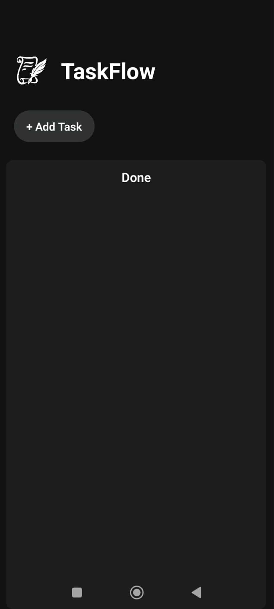

**TaskFlow** to mobilna aplikacja do zarządzania zadaniami, stworzona w **React Native (Expo)**.  
Pozwala dodawać, edytować, usuwać oraz organizować zadania według statusu.

## Funkcje 
  - Dodawanie nowych zadań z tytułem, opisem i priorytetem 
  - Edytowanie istniejących zadań
  - Możliwość usunięcia zadania po zakończeniu
  - Podział zadań na kolumny:
  - **To Do**  
  - **In Progress**  
  - **Done**
  - Zapisywanie zadań w pamięci urządzenia dzięki `AsyncStorage`

## Technologie

- [React Native](https://reactnative.dev/)
- [Expo](https://expo.dev/)
- [TypeScript](https://www.typescriptlang.org/)
- [AsyncStorage](https://github.com/react-native-async-storage/async-storage)

##  Screenshots

